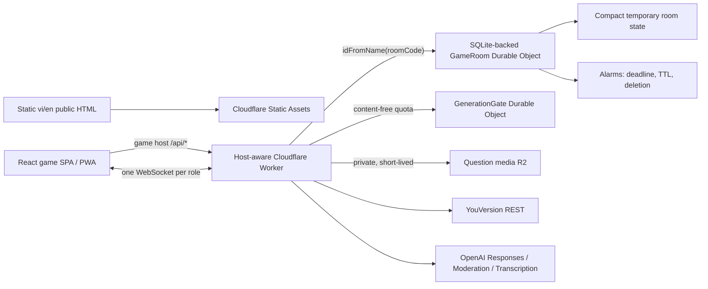

# Đố Kinh Thánh Live

Một website tài liệu song ngữ và web game mobile-first: người dẫn tạo game Kinh Thánh trong trình duyệt, mở phòng tạm thời, chia sẻ mã/QR và chơi cùng mọi người theo thời gian thực.

> Mở lên → tạo game → tạo phòng → cùng chơi → xem bảng xếp hạng → xóa sạch.

**Core realtime gameplay is designed to run at $0 within current Cloudflare Free plan quotas.** AI generation/transcription is separately billable through OpenAI; question media must remain inside R2 Standard free allowances. Không có tuyên bố “free forever” hoặc dung lượng không giới hạn.

> The application is designed to operate within Cloudflare Free plan quotas. When those quotas are exceeded, realtime room operations may temporarily fail until the quota resets or the account is upgraded.

## Trải nghiệm sản phẩm

- Trình tạo game kiểu Google Forms + Kahoot, không có tài khoản hay thư viện lưu lâu dài; bản nháp tự khôi phục trong `sessionStorage` của tab và tự xóa sau khi tạo phòng.
- Tải bản nháp media-free thành `.dkt.json`; game có ảnh/âm thanh dùng gói `.dkt.zip` kiểm tra hash. Cả hai định dạng đều loại mã phòng, capability, token, người chơi và điểm số.
- Năm loại nội dung: chọn một, chọn nhiều đáp án (exact set), đúng/sai, trả lời ngắn chính xác và ô chữ Kinh Thánh hàng ngang/từ khóa dọc.
- Ảnh/MP3 là nội dung câu hỏi tùy chọn cho cả năm loại (kể cả từng hàng ô chữ), độc lập với AI và YouVersion. Upload, xem/nghe, tạo phòng và xuất/nhập gói media không cần khóa OpenAI; chỉ cần bật media với R2 riêng tư và khóa ký URL.
- Trợ lý tùy chọn dùng YouVersion làm nguồn Kinh Thánh và OpenAI để đề xuất câu hỏi; mọi đề xuất phải vượt kiểm tra server và được người tạo chấp thuận/chỉnh sửa. UI chỉ mount integration sau khi health capability xác nhận feature đang bật; khi tắt hoặc provider lỗi, builder thủ công và gameplay không gọi hay phụ thuộc vào AI.
- Tra cứu YouVersion riêng ngay dưới mỗi ô “Câu Kinh Thánh tham khảo”, chỉ cần bật Scripture, không cần AI. Nhập địa chỉ (ví dụ `1 Sa-mu-ên 17:50` hoặc `Giăng 3:16–18`) để xem nội dung kèm bản dịch/ghi nguồn; nội dung tra cứu không được lưu vào bản nháp hay gửi tới OpenAI.
- Hai chế độ: **Theo lượt câu hỏi** (mọi đáp án đúng nhận điểm bằng nhau) và **Đua tốc độ** (mọi người đúng đều có điểm; nhanh hơn được nhiều hơn).
- Ba phiên tách biệt: người dẫn, người chơi và màn hình trình chiếu chỉ đọc.
- Reconnect bằng token tạm trong `sessionStorage`; không dùng `localStorage` hoặc IndexedDB.
- Host có thể sao chép link khôi phục bí mật, tạm dừng/tiếp tục đồng hồ câu hỏi và khóa câu sớm.
- Âm báo và rung là tùy chọn, mặc định tắt để tôn trọng autoplay/accessibility của trình duyệt.
- PWA cài đặt được; gameplay luôn yêu cầu mạng và dữ liệu phòng không được cache offline.
- Responsive từ 360 px tới TV/máy chiếu, điều khiển bàn phím, focus rõ, aria-live và reduced motion.

### Xem giao diện

Sau `bun run dev`, mở các route thật. Localhost dùng cùng một process; production tách theo hostname:

- Public site tiếng Việt: `http://localhost:5173/vi/`
- Public site tiếng Anh: `http://localhost:5173/en/`
- Game home/nhập mã: `http://localhost:5173/`
- Trình tạo game: `http://localhost:5173/create`
- Chính sách dữ liệu public: `http://localhost:5173/vi/quyen-rieng-tu-va-vong-doi-du-lieu/`
- Các route `/join/:code`, `/play/:code`, `/host/:code`, `/screen/:code` được tạo trong luồng phòng thực.

## Kiến trúc



`dokinhthanh.io.vn` phục vụ 26 trang SSG vi/en, sitemap, robots và llms. `game.dokinhthanh.io.vn` phục vụ React SPA/PWA. `wrangler.jsonc` dùng Workers Static Assets không có global SPA fallback; Worker chỉ chạy trước cho API, redirect/crawler files và operational game HTML cần noindex/404/410. Static public pages và hashed asset vẫn được phục vụ ở edge.

Build-time site registry nằm trong `site/`; không có client JavaScript trên public pages. React game bundle không được tải trên apex. Worker sinh shell game generic/no-store/noindex và kiểm tra Durable Object trước khi trả room HTML.

Mỗi mã phòng ánh xạ xác định tới một `GameRoom`. Durable Object là nguồn sự thật duy nhất cho validation đầy đủ, biên dịch round, deadline, câu trả lời, điểm, xếp hạng, quyền phiên, WebSocket và xóa dữ liệu. SQLite-backed Durable Object là **trạng thái tạm thời có khả năng sống qua hibernation/redeploy**, không phải cơ sở dữ liệu vĩnh viễn.

WebSocket dùng Hibernation API (`ctx.acceptWebSocket`, tags, serialized attachment, auto ping/pong), không pin object trong bộ nhớ. Client vẽ countdown từ `deadlineAt`; server không phát tick mỗi giây và Alarms khóa round theo deadline đã lưu.

Các mutation của một phòng được đưa qua hàng đợi tuần tự trong Durable Object. Điều này ngăn burst join/ticket/answer đồng thời ghi đè map trạng thái sau các điểm `await`, đồng thời giữ sequence và scoring nhất quán.

## Luật chơi quan trọng

- Mỗi active player được trả lời đúng một lần mỗi round; riêng hàng dọc ô chữ chỉ được đoán một lần trong toàn bộ ô chữ. Retry cùng `submissionId` là idempotent.
- Server nhận thời gian, từ chối đáp án sau deadline và không tin timestamp/score từ client.
- Pause dừng deadline và nhận đáp án; resume tạo deadline mới từ thời gian còn lại. SPEED_RACE loại thời gian pause khỏi response time.
- Theo lượt: 1.000 điểm cho round thường/hàng ngang.
- Đua tốc độ: 500–1.000 điểm cho round thường/hàng ngang; làm tròn 10 điểm.
- Từ khóa dọc có tối đa 2.000 điểm ở cả hai chế độ, giảm tuyến tính theo số ký tự đặc biệt đã được mở và bằng 0 khi toàn bộ hàng ngang đã hiện. Điểm đoán đúng được cộng trong vòng hàng ngang đang chơi.
- Equal scores chia sẻ competition rank (`1, 1, 3`). Chế độ tốc độ thêm correct count và tổng response time làm tie-break.
- Đáp án riêng không có trong player/screen snapshot trước reveal.
- Trả lời ngắn chỉ so khớp normalized exact form và alias rõ ràng; không fuzzy/AI matching.
- Ô chữ có 3–10 hàng, cell theo grapheme tiếng Việt. Trong mỗi vòng hàng ngang, người chơi có thể dùng nút giải hàng dọc; đáp án dọc không được reveal cho người khác cho tới khi đáp án hàng ngang cuối được mở.

## Vòng đời và xóa dữ liệu

- Lobby hoặc game đang chạy: xóa sau 2 giờ không có hoạt động host.
- Tuổi thọ tuyệt đối: 6 giờ.
- Kết thúc bình thường: giữ bảng kết quả 5 phút, cảnh báo khi còn 60 giây, rồi xóa.
- Người dẫn có thể xác nhận “Kết thúc và xóa phòng ngay”.
- Cleanup chuyển sang `DELETING`, broadcast, đóng socket và luôn gọi `ctx.storage.deleteAll()`.

Ứng dụng không có replay, lịch sử, thư viện quiz trên máy chủ, leaderboard vĩnh viễn, email/số điện thoại, quảng cáo hay analytics SDK. Media câu hỏi là object private sống tối đa một ngày; capability builder không vào game, log hay file export. Người tạo có thể tải `.dkt.json` tối đa 512 KiB hoặc `.dkt.zip` media tối đa 50 MiB; import kiểm tra đường dẫn ZIP, số member, kiểu nén, CRC, SHA-256, MIME và giới hạn media trước khi cấp asset ID mới. File đã tải xuống do người dùng tự quản lý và ứng dụng không thể tự xóa file đó.

Bản nháp builder trong trình duyệt chỉ tồn tại trong phiên tab và bị xóa sau create-room. Raw short-answer text chỉ tồn tại đủ lâu để normalize/so sánh và không được ghi vào storage. Token server-side chỉ được lưu dưới SHA-256 hash.

Ứng dụng không tuyên bố rằng Cloudflare không có platform-level operational metadata; phạm vi ở đây là dữ liệu mà chính ứng dụng chủ động lưu và xóa.

## Route và giao thức

Game SPA routes trên `game.dokinhthanh.io.vn`:

| Route | Vai trò |
| --- | --- |
| `/` | Trang chủ và nhập mã phòng |
| `/create` | Game Builder trong React memory |
| `/join/:roomCode` | Tên/avatar và join |
| `/play/:roomCode` | Gameplay người chơi |
| `/host/:roomCode` | Bảng điều khiển người dẫn |
| `/screen/:roomCode` | Màn hình trình chiếu read-only |
| `/privacy` | Legacy; direct request redirect về policy public trên apex |

HTTP dùng cho room lifecycle, Scripture read APIs, AI suggestions, private media và health:

`POST /api/rooms`, `GET /api/rooms/:code/public`, `POST /api/rooms/:code/join`, `POST /api/rooms/:code/ws-ticket`, `GET /api/rooms/:code/ws`, `POST /api/rooms/:code/leave`, `GET /api/scripture/*`, `POST /api/question-suggestions`, `/api/question-media/*`, `GET /api/health`.

Host/screen bootstrap token nằm trong URL fragment, được chuyển ngay vào `sessionStorage` rồi xóa khỏi URL. Host có thể chủ động sao chép lại recovery URL chứa fragment; URL này là secret toàn quyền và UI cảnh báo không chia sẻ công khai. Long-lived token không vào WebSocket query; query chỉ mang one-time ticket role/room/session-bound, sống khoảng 30 giây và bị xóa khi dùng lần đầu.

Server events có `protocolVersion`, global monotonic `sequence`, `serverTime`, `roomStateVersion` và payload. Normal play dùng event nhỏ (`round.opened`, `round.paused`, `round.resumed`, `answer.accepted`, `round.answer_count`, `round.locked`, `round.revealed`, `leaderboard.updated`); full snapshot chỉ dùng khi connect/reconnect hoặc client thấy sequence gap.

## Yêu cầu local

- Bun 1.3+
- Một Cloudflare account Free cho deploy; custom domain không bắt buộc
- Playwright browsers nếu chạy E2E

```bash
bun install
bun run dev
```

Local development không cần Turnstile. Đặt `APP_ENV=development` trong `.dev.vars` nếu cần cấu hình rõ. Không commit `.dev.vars`. Các feature YouVersion/AI/media mặc định tắt; xem [runbook triển khai](docs/QUESTION_INTELLIGENCE_OPERATIONS.md).

### Turnstile tùy chọn cho production

Tạo Turnstile Free widget với action `create-room`, đặt site key thành `VITE_TURNSTILE_SITE_KEY`, rồi lưu secret bằng Wrangler:

```bash
bunx wrangler secret put TURNSTILE_SECRET_KEY
```

Client render widget explicit. Server xác minh success, hostname và action qua Siteverify đúng một lần ở create-room. Không yêu cầu Turnstile cho từng câu trả lời. Test local để trống cả hai giá trị.

Sau deploy, kiểm tra `GET /api/health`: `turnstileProtected` phải là `true` trước khi chia sẻ URL production. Nếu là `false`, room creation vẫn chạy nhưng chưa có lớp chống bot; cấu hình cả site key lúc build và Worker secret rồi deploy lại.

## Kiểm tra

```bash
bun run typecheck
bun run lint
bun run test
bun run test:unit
bun run test:worker
bun run test:e2e
bun run test:seo
bun run test:lighthouse
bun run test:uat
bun run test:load
bun run smoke:production
bun run build
bun run check:free-tier
bunx wrangler deploy --dry-run
```

`test:worker` chạy trong Cloudflare Workers Vitest/Miniflare. `test:e2e` chạy bộ gameplay chính trên Chromium và UAT trên Chromium, Firefox, WebKit, Chrome mobile và Safari mobile. `test:uat` chạy ma trận UAT về draft/PWA, tải–nhập cấu hình giữa hai phiên thiết bị, pause/recovery và feedback. `test:load` khởi động local Cloudflare runtime, burst tối đa 100 join + WebSocket + answer và luôn xóa phòng test; không bắn load test vào production. CI chạy local emulation, build, free-tier audit và dry-run; không tạo remote rooms.

`check:free-tier` thất bại nếu phát hiện forbidden binding/dependency, global Worker-first routing, global SPA fallback gây soft 404, thiếu SQLite migration/ASSETS binding, localStorage/IndexedDB room persistence, HTTP polling, server timer tick, Worker bundle vượt mục tiêu an toàn 2.5 MB gzip hoặc initial game JavaScript vượt 100 KiB gzip. Các route game nặng được lazy-load; build production mặc định không upload source map, có thể bật chủ động bằng `SOURCE_MAPS=true`.

## Build và deploy

```bash
bun run build
bun run check:free-tier
bun run deploy
```

`bun run deploy` build và deploy cả Worker lẫn Static Assets thành một ứng dụng. Migration `v1` tạo `GameRoom`; migration `v2` tạo `GenerationGate` chỉ lưu bộ đếm quota không chứa nội dung. Đích zero-domain-cost là:

```text
https://do-kinh-thanh-live.<your-subdomain>.workers.dev
```

Production đã khai báo apex, `www` và `game` custom domain trong Wrangler. Cần activate DNS/certificate cho `game` trong Cloudflare dashboard trước cutover. Không bật Workers Paid hoặc thêm service binding khác để vận hành kiến trúc hiện tại.

Workflow `Deploy production` tự chạy sau CI trên `main` khi environment `production` có `CLOUDFLARE_API_TOKEN` và `CLOUDFLARE_ACCOUNT_ID`; nếu thiếu, workflow ghi rõ “Deployment skipped” và không gọi Cloudflare. Sau deploy, workflow chạy `smoke:production` để kiểm tra redirects, public HTML, crawler files, 404/410, noindex, cache và API content type. `VITE_TURNSTILE_SITE_KEY` là repository/environment variable tùy chọn; Worker secret vẫn phải được lưu trực tiếp bằng Wrangler.

## Bảo mật

- Same-origin API, method/content-type/body-size checks và strict Zod schemas.
- 8 KiB WebSocket message limit, finite discriminated command union và per-room/per-connection throttling.
- Cryptographic room codes, IDs, tokens, tickets; SHA-256 token hashes; one-time replay prevention.
- Role authorization trên mọi command; screen không mutate, player không điều khiển game.
- Không `dangerouslySetInnerHTML`; user content render bằng text.
- CSP, `frame-ancestors`, Referrer Policy, Permissions Policy, nosniff và `no-store` cho API.
- PWA precache chỉ shell/versioned assets; `/api/*` luôn NetworkOnly và dynamic room data không cache.
- PWA có favicon, icon PNG 192/512, maskable icon và Apple Touch icon sinh từ logo local.
- YouVersion/OpenAI chỉ được gọi từ Worker; Responses dùng strict JSON Schema, `store:false`, không tools/web.
- Media kiểm tra signature/kích thước/thời lượng, loại metadata, lưu R2 riêng tư và cấp URL HMAC theo phòng; upload không gọi OpenAI. Moderation/transcription chỉ chạy khi người tạo chủ động gửi media cho trợ lý AI tùy chọn.
- Không log câu hỏi, nội dung Kinh Thánh, đáp án, media/transcript, tên người chơi, IP thô, capability hoặc secret.

## Giới hạn thực tế

- Khuyến nghị Free-tier: 10–50 người, 10–30 runtime rounds, 15–90 phút/phòng, một host và một screen.
- Hard limit 100 players, 50 top-level items, 100 rounds, payload 512 KiB và sáu giờ không đồng nghĩa với unlimited simultaneous rooms.
- Khi quota/overload xảy ra, static UI có thể vẫn mở nhưng room operation có thể tạm thất bại với thông báo thân thiện.
- Realtime gameplay không hoạt động offline.
- Local UAT có thể kiểm tra 100 người, nhưng không chạy automated load test trên deployed Free Worker và kết quả local không bảo đảm hạ tầng/quota production tại mọi thời điểm.

Chi tiết phép tính và cách theo dõi dashboard nằm trong [docs/FREE_TIER_BUDGET.md](docs/FREE_TIER_BUDGET.md).
